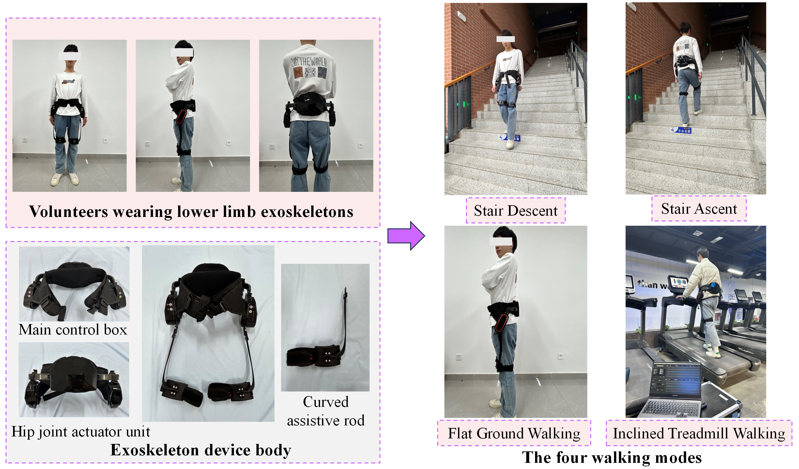
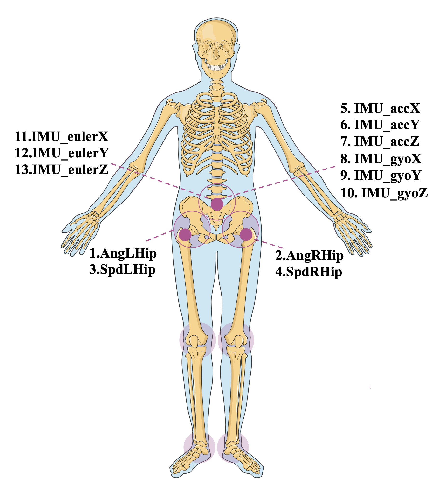

# AUST_gait
AUST-gait dataset and introduction.(AUST-gait数据集及介绍)

## Introduction
The AUST-gait dataset, collected by Anhui University of Science and Technology, is specifically designed for gait analysis, supporting time-series prediction and classification tasks. The dataset is collected through a wearable hip exoskeleton robot and contains various sensor data, suitable for research in missing value processing and gait recognition.

## Equipment and Sensors
- **Equipment**: Hip exoskeleton robot
- **Sensors**:
    - 6-axis IMU sensor: Mounted on the back, measuring three-axis acceleration and angular velocity
    - Motor shaft encoder and 12-bit output shaft encoder: Measuring angles and angular velocities of left and right hip joints

## Experimental Procedure

  

<em>Figure 1: On-site photos of data collection (数据采集现场照片)</em>
 

65 healthy adults were recruited (age 23±2 years, height 1.74±0.05 meters, weight 80±8.6 kg), excluding specific conditions. The experiment received ethics committee approval, and participants signed informed consent forms.

**Participants performed four walking modes under supervision**:
1. Flat Ground Walking (FG): Walking back and forth three times on a 6-meter long, 1.2-meter wide track
2. Stair Ascent (SA): Climbing a 10-step staircase (15cm per step), repeated 3 times
3. Stair Descent (SD): Descending a 10-step staircase, repeated 3 times
4. Inclined Treadmill Walking (IT): Walking on a treadmill inclined at 20° for 45 seconds  
**Additionally, fall experiments were conducted to simulate extreme conditions.**

## Data Description  

  

<em>Figure 2: Illustration of dataset features (数据集特征说明图)</em>
   

**Feature Format**: Each time point contains 13 features, recorded in Excel cells with20ms intervals.

**Features Include**:
- Left hip angle
- Right hip angle
- Left hip angular velocity
- Right hip angular velocity
- Back IMU X-axis acceleration
- Back IMU Y-axis acceleration
- Back IMU Z-axis acceleration
- Back IMU X-axis angular velocity
- Back IMU Y-axis angular velocity
- Back IMU Z-axis angular velocity
- Back IMU X-axis Euler angle
- Back IMU Y-axis Euler angle
- Back IMU Z-axis Euler angle

**Labels (Walking categories in the last column)**:
- 0: Flat ground walking
- 1: Stair ascent
- 2: Stair descent
- 3: Inclined treadmill walking
- 4: Fall experiment

**Dataset Structure**:
- Training set: 75%
- Test set: 25%
- Fall experiment data: Can be combined with other datasets

**Tasks**:
- Prediction task: Learn from first 10 steps to predict the 11th step
- Recognition task: Classify different walking modes

**Missing Value Processing**: Users can employ various algorithms to simulate missing values, and the dataset supports experiments with different missing rates.

## License：This dataset is released under open data sharing principles. Users can freely use, modify, and distribute the data with proper attribution.

## If you have any questions, feel free to raise an issue

---
This README is formatted in Markdown and can be directly uploaded to a GitHub repository.
